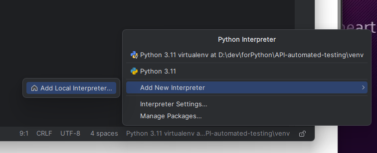
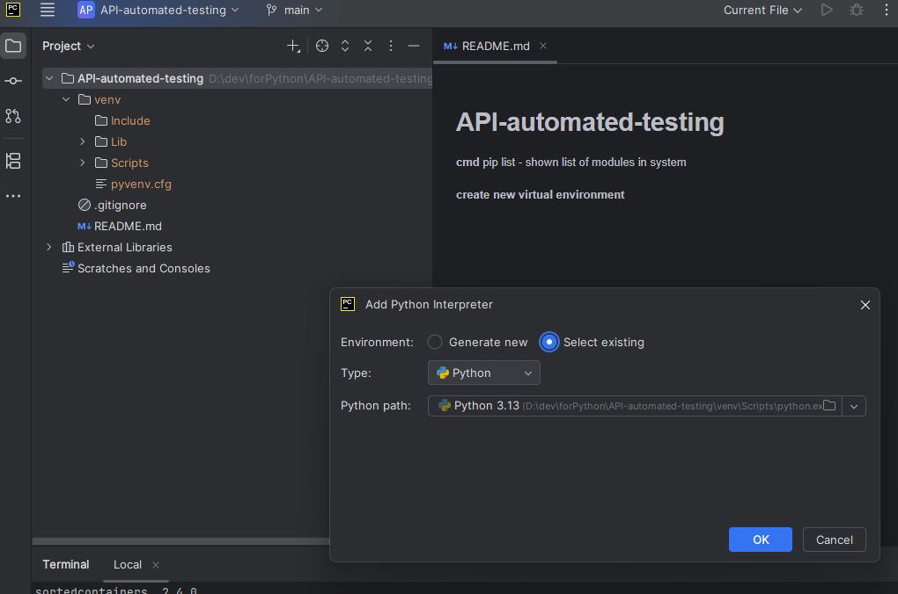
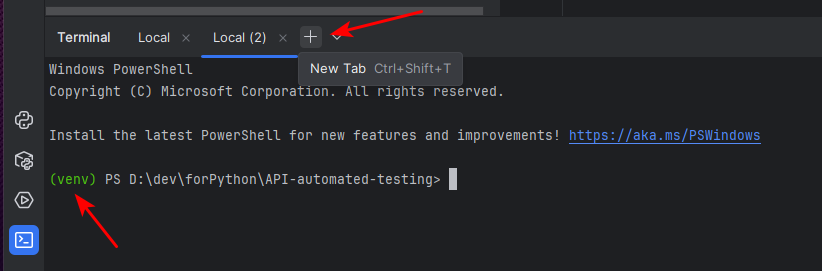
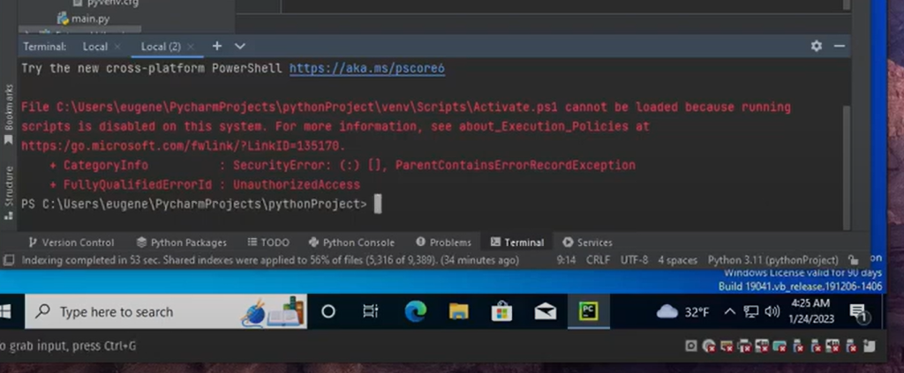

# newone
Actions-App-Automations
RUN
clone project

set up venv
create new virtual environment

python -m venv venv

py -m venv venv

python3 -m venv venv

Select virtual environment for use in current project img

img_1
transfer to virtual environment img_2
[img_2.png](img_2.png) img_3
if something like that !

go to PowerShell as Administrator

Set-ExecutionPolicy RemoteSigned

A

Create New Tab again

Install
pip install pytest-playwright

playwright install

Requirements
get list of installed tools

pip list

Generate a list of all Python packages currently installed in the active virtual environment (or in the global Python environment) and save the list to the requirements.txt file

pip freeze > requirements.txt

Install all Python packages listed in the file

pip install -r requirements.txt

# (------------test_first.py----------)
from playwright.sync_api import Page, expect

def test_wiki2(page:Page):
    page.goto('https://www.wikipedia.org/')
    page.get_by_role('link', name='English').click()
    expect(page.get_by_text('From today\'s featured article')).to_be_visible()
    page.get_by_role('link', name='Talk').click()
    expect(page.locator('#talkheader')).to_contain_text('Welcome! This page is for discussing the contents of the English Wikipedia\'s Main Page.')
About
No description, website, or topics provided.
Resources
 Readme
 Activity
Stars
 0 stars
Watchers
 0 watching
Forks
 0 forks
Report repository
Releases
No releases published
Packages
No packages published
Languages
Python
100.0%
Footer
© 2026 GitHub, Inc.
Footer navigation
Terms
